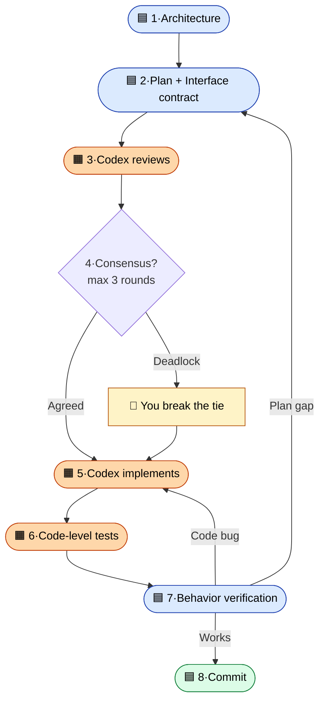

<div align="center">


[](LICENSE)
[](https://claude.com/claude-code)
[](#)

**English** | [中文](./README_zh.md)

</div>

> You asked Claude to fix the bug. Claude said done. You ship it.
> An hour later you find out it's still broken — and you couldn't have known, because you can't read the code.
>
> **This skill makes that scenario impossible.**

## ✨ How it feels

```
┌─ Claude Code ─────────────────────────────────────────────────────┐
│                                                                   │
│  You      Make me a CLI that converts PDF to Markdown.            │
│           Use codex-pair on this.                                 │
│                                                                   │
│  Claude   Two paths — A) PyMuPDF + custom writer                  │
│                       B) Marker (heavier, better tables)          │
│           Which?                                                  │
│                                                                   │
│  You      A.                                                      │
│                                                                   │
│           ⋯  20 minutes of two AIs working  ⋯                    │
│                                                                   │
│  Claude   Done.                                                   │
│           ✓ Codex caught 2 bugs during review (looped once)      │
│           ✓ Tests pass · I ran it on a real PDF · works          │
│           ✓ Committed as a3f9b2e                                 │
│                                                                   │
└───────────────────────────────────────────────────────────────────┘
```

You touched the keyboard **twice** — once to start, once to pick A.

## 🧭 The pipeline



🟦 Claude · 🟧 Codex · 👤 You (only on real deadlocks)

## 🚀 Install

```bash
git clone https://github.com/birdindasky/codex-pair ~/codex-pair-src
cp -r ~/codex-pair-src/skills/codex-pair ~/.claude/skills/
```

Open Claude Code, type `/`, look for `codex-pair`.

**Needs:** [Claude Code](https://claude.com/claude-code) + [`openai/codex-plugin-cc`](https://github.com/openai/codex-plugin-cc) plugin. Run `/codex:setup` once if Codex isn't set up yet.

## 🎬 Trigger phrases

In any Claude Code conversation, say one of:

- `codex pair this`
- `two-AI mode`
- `use codex on this`

Mid-pipeline overrides: `skip codex` (cancel) · `skip review` (bypass review) · `run them in parallel` (switch to worktree mode).

## ⚖️ Tradeoffs

Costs roughly **2× tokens** of solo Claude · **slower** than solo (consensus loop adds time) · **won't save you from wrong requirements** at step 1. For typo fixes or one-line tweaks, just ask Claude directly. This pipeline is for **projects**.

## 📂 Files

- [`skills/codex-pair/SKILL.md`](skills/codex-pair/SKILL.md) — the actual skill
- [`PROTOCOLS.md`](PROTOCOLS.md) — worklog · pending-commits · venv specs
- [`examples/walk-through.md`](examples/walk-through.md) — full end-to-end example: building a PDF→Markdown CLI
- [`LICENSE`](LICENSE) — MIT

Inspired by [Matt Pocock's skills repo](https://github.com/mattpocock/skills). Pipeline design is this project's own.

---

<div align="center">

**Built by [@birdindasky](https://github.com/birdindasky) · For everyone who codes by vibes.**

⭐ Star if this saves you from one silent AI bug.

</div>
