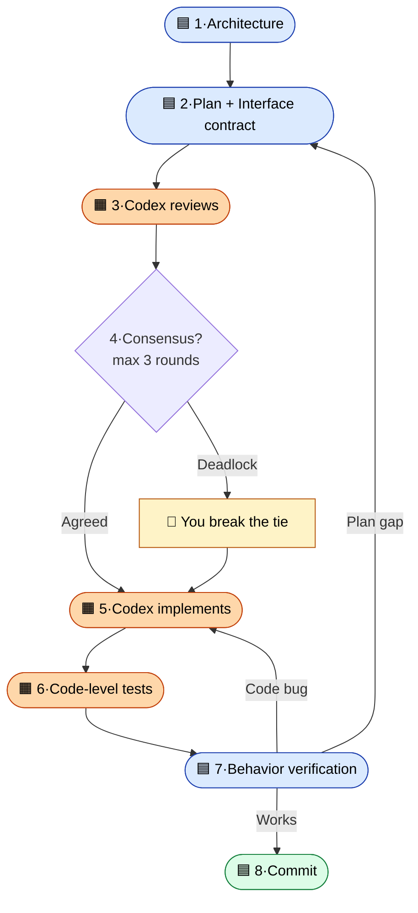

<div align="center">


[](LICENSE)
[](https://claude.com/claude-code)
[](#)

[English](./README.md) | **中文**

</div>

> 你让 Claude 修个 bug。Claude 说修好了。你就上线了。
> 一小时后才发现根本没修好——而你压根没法提前知道,因为你看不懂代码。
>
> **这个 skill 让上面这种事不可能再发生。**

## ✨ 用起来什么感觉

```
┌─ Claude Code ─────────────────────────────────────────────────────┐
│                                                                   │
│  你       帮我做一个把 PDF 转 Markdown 的 CLI。                    │
│           这个项目用 codex-pair。                                  │
│                                                                   │
│  Claude   两条路 — A) PyMuPDF + 自己写转换器                       │
│                    B) Marker(更重,但表格识别更好)                │
│           选哪个?                                                 │
│                                                                   │
│  你       A。                                                      │
│                                                                   │
│           ⋯  两个 AI 干了 20 分钟  ⋯                              │
│                                                                   │
│  Claude   做完了。                                                 │
│           ✓ Codex 在 review 时抓到 2 个 bug(循环了一轮)          │
│           ✓ 测试通过 · 我用真实 PDF 跑了一遍 · 没问题              │
│           ✓ 已提交为 a3f9b2e                                       │
│                                                                   │
└───────────────────────────────────────────────────────────────────┘
```

你一共只动了键盘 **两次** —— 一次启动,一次选 A。

## 🧭 流水线



🟦 Claude 负责 · 🟧 Codex 负责 · 👤 你只在真卡住时介入

## 🚀 安装

```bash
git clone https://github.com/birdindasky/codex-pair ~/codex-pair-src
cp -r ~/codex-pair-src/skills/codex-pair ~/.claude/skills/
```

打开 Claude Code,输入 `/`,找到 `codex-pair`。

**前置依赖:**[Claude Code](https://claude.com/claude-code) + [`openai/codex-plugin-cc`](https://github.com/openai/codex-plugin-cc) 插件。如果还没装好 Codex,先跑一次 `/codex:setup`。

## 🎬 触发口令

在任何 Claude Code 对话里,说一句:

- `codex pair this`
- `two-AI mode`
- `use codex on this`

中途想改主意:`skip codex`(取消整个流程)· `skip review`(跳过 review 这一步)· `run them in parallel`(切到 worktree 并行模式)。

## ⚖️ 代价

token 大约是单跑 Claude 的 **2 倍** · **比单跑慢**(共识循环要时间)· **救不了你提的需求本身就是错的**(第 1 步是架构,不是需求)。改个错别字、调一行代码,直接问 Claude 就行。这条流水线是给**正经项目**用的。

## 📂 文件

- [`skills/codex-pair/SKILL.md`](skills/codex-pair/SKILL.md) — 真正的 skill 文件
- [`PROTOCOLS.md`](PROTOCOLS.md) — worklog · pending-commits · venv 协议规范
- [`examples/walk-through.md`](examples/walk-through.md) — 一个完整端到端的例子:从零做一个 PDF→Markdown 的 CLI
- [`LICENSE`](LICENSE) — MIT

灵感来自 [Matt Pocock 的 skills 仓库](https://github.com/mattpocock/skills)。流水线设计是这个项目自己的。

---

<div align="center">

**作者 [@birdindasky](https://github.com/birdindasky) · 献给所有靠感觉写代码的人。**

⭐ 如果它哪怕帮你拦下一个 AI 偷偷藏着的 bug,star 一下吧。

</div>
